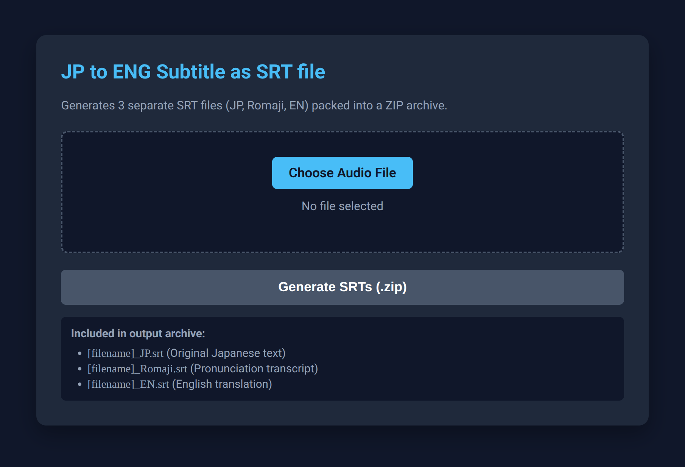

## JP to ENG Subtitle as SRT
This is a program that turn a japanese voice audio into an english + japanese + romaji subtitle (as separate SRT file)

this is purely made for fun

made with Gemini Flash 3.7

## My Hardware
RAM: 8GB

CPU: i5-1135G7

GPU: -

OS: Linux Mint 22.3

## Setup (For Linux)
```bash
python3 -m venv venv
source venv/bin/activate

pip install flask faster-whisper deep-translator pykakasi\
```

## Running program
Command:
```bash
source venv/bin/activate

python app.py
```

Open this website in your browser:
```bash
http://127.0.0.1:5000
```
